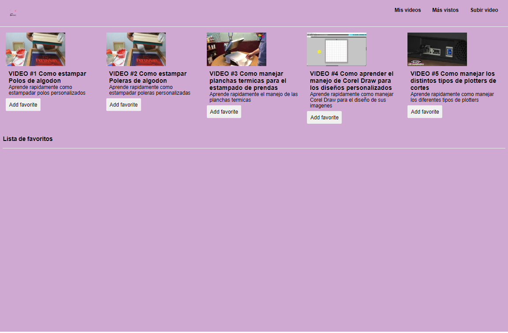
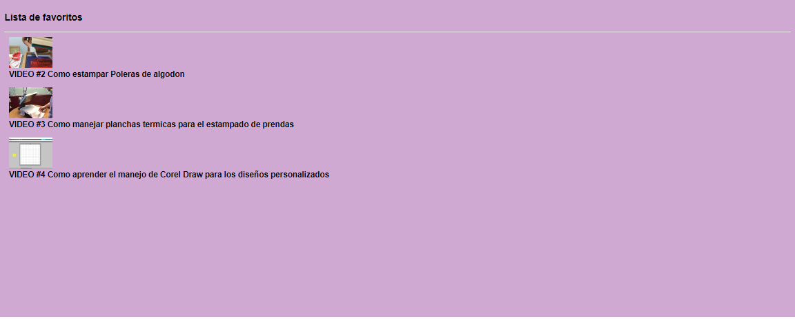
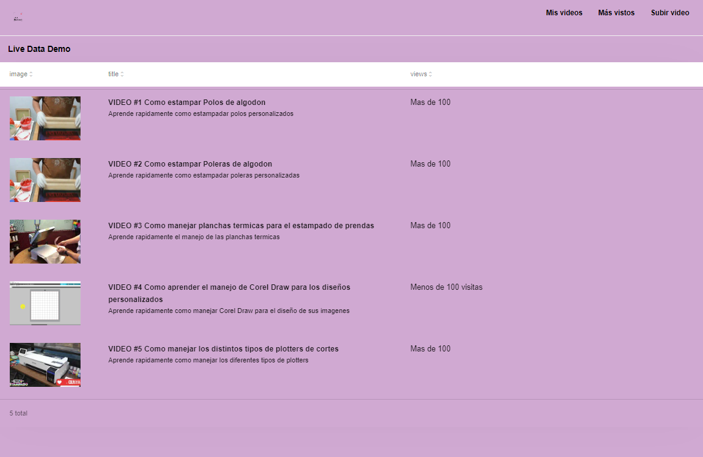

# Welcome to the Page of Videos Tutorials (Demo)! 🎞🎬
An application whose purpose is to have a collection of videos referring to the garment printing process, 
it has a login page, as well as sections of favorite videos, detailed videos and a section to check the visualizations of the same in a better way.

# Steps to run the project 🚨:

  
  
  
  

                                          
1.- Once the project is downloaded, Once the project is downloaded, access the terminal of your console.

    * - To access open the terminal (Control + Ñ) or (Terminal - New Terminal).
    * - Run the command "npm install"
   

  

                                           
Once having both steps perfectly, we proceed to execute the environments

    * - You need to run both the front-end and the back-end so you have to run it through two separate environments.

   
  

                                    
## More info about me: 

Ing. Kevin J. Montero Zea 

CE: 004712881 🆔

+51-913-695-382 📱

<a href="https://www.linkedin.com/in/kevin913montero/">
    LinkedIn 👨‍🦰
  </a>

<a href="https://portfoliokjmz.netlify.app/">
    Portfolio 💼
  </a>

